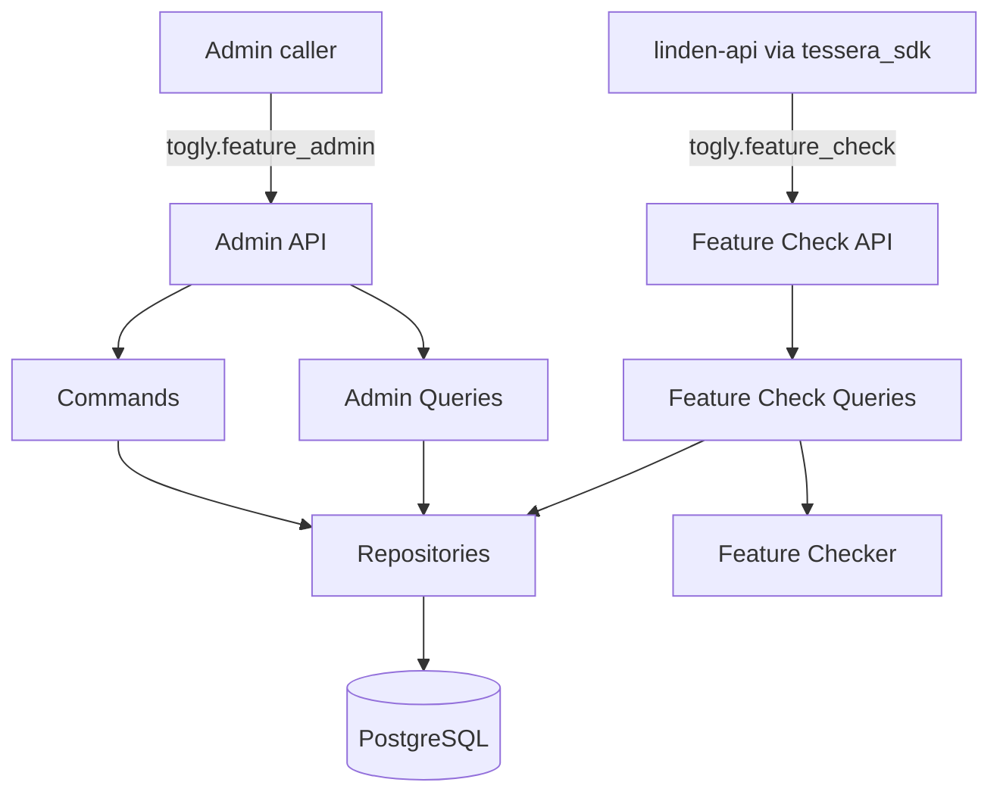

# Design Document: Feature Flag Service

Implements [docs/prds/0001-feature-flag-service.md](../prds/0001-feature-flag-service.md).

## Overview

Togly exposes two authenticated HTTP interfaces backed by one PostgreSQL schema:

1. An admin API for creating features and changing boolean or actor gates.
2. A Feature Check API that answers whether features are enabled for a required actor.

The first consumer is `linden-api`, through a thin Python client implemented in
`tessera_sdk`. Every check is evaluated live by Togly. There is no local ruleset cache,
polling protocol, or gate logic in the SDK.

Browser access, a JavaScript SDK, the linden-portal integration, percentage rollout, and
an admin UI are deferred.

## Architecture



### Write path and transactions

Each command writes the requested feature or gate mutation and its audit record together
in a **single transaction**. If the audit insert fails, the whole transaction rolls back
and the command surfaces an error — the API never returns success for a mutation whose
audit record didn't also persist. The audit log's purpose is incident forensics ("who
turned this off?"), so a mutation existing without a matching audit row is treated as a
correctness bug, not an acceptable best-effort gap: a two-phase commit-then-audit design
would let exactly that gap appear during the kind of infrastructure instability that
correlates with incidents, with no signal to the caller.

FastAPI's database dependency closes the session when the request ends; closing a session
is cleanup, not a substitute for the explicit commit.

### Read path

The caller may supply an `actor_id`. When present, Togly authorizes that specific actor
domain, loads the requested feature and its gates, and checks both the boolean and actor
rules in one server-side component. When `actor_id` is omitted, Togly authorizes against
the global domain and evaluates only the boolean gate — a purely global flag (no actor
gates configured) doesn't require the caller to invent an actor just to check it. Unknown
keys return `false`, allowing code to deploy before a flag is created.

## Components and Interfaces

### FeatureRepository and GateRepository

Responsibilities:

- Create, delete, retrieve, and list features.
- Load gates with their feature.
- Add or remove a boolean gate.
- Add or remove actor gates by `(feature_id, actor_id)`.
- Rely on database uniqueness constraints for concurrency safety.

Repositories add and flush records but do not own transaction boundaries. Commands and
queries receive a SQLAlchemy session through the existing FastAPI dependency.

### FeatureAuditLogRepository

Responsibilities:

- Append an audit entry containing immutable `feature_id`, denormalized `feature_key`,
  actor, action, snapshot, and timestamp.
- List entries by `feature_id`, newest first.

The audit table deliberately does not use a cascading foreign key to `features`, so its
records remain after feature deletion. The key is retained for readability, while the ID
is the stable identity used for correlation.

### Commands

- `CreateFeatureCommand`
- `DeleteFeatureCommand`
- `EnableBooleanGateCommand` / `DisableBooleanGateCommand`
- `EnableActorGateCommand` / `DisableActorGateCommand`

Representative interfaces:

```python
CreateFeatureCommand(db, key, description, current_user).execute() -> Feature
EnableActorGateCommand(db, feature_key, actor_id, current_user).execute() -> Gate
DisableBooleanGateCommand(db, feature_key, current_user).execute() -> None
```

Every command receives `current_user` explicitly from the router and uses it to stamp the
audit record. Authorization remains a router dependency and is not repeated in commands.

### Queries

- `ListFeaturesQuery(db).execute() -> list[FeatureWithGates]`
- `GetFeatureQuery(db, key).execute() -> FeatureWithGates`
- `GetFeatureAuditLogQuery(db, feature_id).execute() -> list[AuditEntry]`
- `CheckFeatureQuery(db, key, actor_id).execute() -> FeatureCheck`
- `ListEnabledFeaturesQuery(db, actor_id).execute() -> list[str]`

### Feature Checker

The checker is a pure server-side function:

```python
def is_enabled(gates: list[Gate], actor_id: str | None) -> bool: ...
```

A feature is enabled when its boolean gate is on **or** (if `actor_id` is supplied) it has
an actor gate matching the requested actor. When `actor_id` is `None`, only the boolean
gate is considered — actor gates never match without an actor to compare against. A
feature with no matching gate is disabled.

Whether turning off the global boolean gate must also override matching actor gates is
intentionally unresolved and must be decided before implementing disable behavior. No
percentage, group, expression, or time-based logic is included in v1.

## Authorization

Togly uses two separate Custos resources:

- `togly.feature_admin` for all feature and gate administration.
- `togly.feature_check` for runtime checks.

Resource names use underscores. The existing `build_rbac_dependencies` helper must accept
an optional domain resolver rather than always using `global_domain`.

Admin routes use domain `"*"`. Feature Check routes accept an optional `actor_id`: when
supplied, that exact value is the Custos domain, preventing a caller authorized for actor A
from checking actor B; when omitted, the check uses domain `"*"` and only the boolean gate
is evaluated (see Feature Checker). `linden-api` receives a service-account grant covering
the actors it serves (a global grant where the Custos policy permits it) plus the `"*"`
domain for actor-less checks.

Togly itself does not infer project membership or actor type. Actor IDs are opaque strings;
callers namespace them if different actor types could collide.

## HTTP API

### Admin API

| Method | Path | RBAC action | Handler |
|---|---|---|---|
| POST | `/features` | create | `CreateFeatureCommand` |
| GET | `/features` | read | `ListFeaturesQuery` |
| GET | `/features/{key}` | read | `GetFeatureQuery` |
| DELETE | `/features/{key}` | delete | `DeleteFeatureCommand` |
| POST / DELETE | `/features/{key}/gates/boolean` | update | enable/disable boolean gate |
| POST / DELETE | `/features/{key}/gates/actors/{actor_id}` | update | enable/disable actor gate |
| GET | `/feature-audit-logs/{feature_id}` | read | audit history by immutable feature ID |

All routes use `togly.feature_admin` with the global domain. Admin feature responses
include the immutable ID needed to query audit history. List responses are paginated using
the repository's existing pagination convention.

### Feature Check API

| Method | Path | RBAC domain | Response |
|---|---|---|---|
| GET | `/feature-checks/{key}?actor_id={actor}` | requested actor, or `"*"` if omitted | `{"key": "new_dashboard", "enabled": true}` |
| GET | `/enabled-features?actor_id={actor}` | requested actor, or `"*"` if omitted | `{"features": ["new_dashboard"]}` |

Both routes use `togly.feature_check`. The collection route omits every disabled feature
rather than returning a key-to-boolean map. `actor_id` is optional — omitting it
authorizes against the global domain and returns only globally enabled features. The
single-resource endpoint is named for checking one feature; the collection endpoint is
named for the enabled features it returns.

## Python SDK in `tessera_sdk`

The Togly client belongs in `tessera_sdk`, not in `linden-api`, so authentication,
timeouts, error mapping, and request behavior are shared and versioned consistently.

```python
client.is_enabled("new_dashboard", actor_id=project_id, default=False) -> bool
client.is_enabled("maintenance_mode", default=False) -> bool  # actor_id optional, global-only check
client.enabled_features(actor_id=project_id) -> list[str]
```

The client:

- Uses `AuthTokenProvider` for the linden-api service account.
- Sends the bearer token on each request.
- Uses a short configurable timeout (initial default: 300 ms).
- Returns the caller's default only for connection errors, timeouts, and Togly 5xx
  responses.
- Surfaces 401 and 403 as authentication/authorization failures.
- Surfaces every other 4xx as a client or API-contract error.
- Does not cache feature results or contain feature-check logic.

### Authorization-cache bug — mitigated by not enabling the cache

`tessera_sdk`'s authorization dependency has a real bug: its cache write only ever stores
key `allowed`, but the cache-hit read path checks `authorized`, so any cache hit
incorrectly denies a previously-granted request. This is not a v1 blocker, though: the
cache is opt-in — `authorization_cache_enabled` defaults to `false` in `tessera_sdk`'s own
settings — so Togly is not exposed to this bug as long as it leaves
`AUTHORIZATION_CACHE_ENABLED` unset. Togly's `tessera-sdk` dependency also tracks
`branch = "main"` rather than a version tag, so "pin a version containing the fix" isn't a
concrete, checkable gate as currently declared; requiring it would block v1 on an
artifact that doesn't exist in how the dependency is pinned today.

**Decision**: ship v1 with `AUTHORIZATION_CACHE_ENABLED` at its default (`false`/unset).
Revisit enabling the cache only once the `tessera_sdk` fix is confirmed merged on `main`
(and, if real pin-and-verify semantics are wanted, once the dependency is switched from a
branch reference to a tagged `rev`). A regression test still exercises the same cached
authorization result twice to catch a future regression of this bug once caching is
eventually turned on, but it does not gate v1.

## Data Models

### Feature

| Field | Type | Required | Description |
|---|---|---|---|
| id | UUID | Yes | Primary key and immutable identity |
| key | string | Yes | Unique public key |
| description | string | No | Admin-facing text |
| created_at / updated_at | timestamp | Yes | Standard timestamps |

### Gate

| Field | Type | Required | Description |
|---|---|---|---|
| id | UUID | Yes | Primary key |
| feature_id | UUID, FK | Yes | Cascades on feature deletion |
| gate_type | enum | Yes | `boolean` or `actor` |
| value | text | Yes | `"true"` or an actor ID |
| created_at / updated_at | timestamp | Yes | Standard timestamps |

Database constraints:

- `UNIQUE (feature_id, gate_type) WHERE gate_type = 'boolean'`
- `UNIQUE (feature_id, gate_type, value) WHERE gate_type = 'actor'`

Duplicate actor enables are idempotent. Only an enabled boolean row is stored; disabling
removes it.

### FeatureAuditLog

| Field | Type | Required | Description |
|---|---|---|---|
| id | UUID | Yes | Primary key |
| feature_id | UUID | Yes | Immutable correlation ID retained after deletion |
| feature_key | string | Yes | Denormalized display value retained after deletion |
| user_id | UUID | Yes | Acting user or service identity |
| action | string | Yes | `created`, `deleted`, `boolean_enabled`, etc. |
| snapshot | JSONB | No | Relevant before/after state |
| created_at | timestamp | Yes | Append timestamp |

Audit entries are append-only and have no `updated_at`.

## Error Handling

| Scenario | HTTP result | Behavior |
|---|---|---|
| Duplicate feature key | 409 | Reject mutation |
| Unknown feature on admin route | 404 | Reject request |
| Malformed (e.g. empty-string) actor ID | 422 | Reject before query/command — a genuinely absent `actor_id` is valid (global-only check), an empty one is not |
| Unknown feature on check route | 200 | Return disabled |
| Missing/invalid credentials | 401 | SDK surfaces failure |
| Caller lacks requested resource/domain | 403 | SDK surfaces failure |
| Other invalid client input | 4xx | SDK surfaces contract error |
| Togly timeout, connection failure, or 5xx | client-side fallback | Return caller default and log warning |
| Mutation or its audit write fails | 500 | Roll back the whole transaction — no partial state where a mutation succeeds without its audit row |

## Testing Strategy

- Feature Checker unit tests: boolean on/off, matching/nonmatching actor, combined gates,
  no `actor_id` supplied (global-only evaluation), no gates, and the chosen global-disable
  semantics once decided.
- Repository tests against PostgreSQL: feature uniqueness, boolean singleton, actor
  uniqueness/idempotency, cascade behavior, and retained audit records after deletion.
- Command tests: mutation and audit row committed together; a forced audit-write failure
  (e.g. a constraint violation) rolls back the mutation too, not just an assertion that
  both usually succeed.
- Router tests: both resources, every action, actor-domain isolation, an omitted actor id
  authorizing against the global domain, unknown keys, admin/check response separation,
  and disabled features omitted from `/enabled-features`.
- SDK tests: bearer token injection, 300 ms default timeout, network/timeout/5xx fallback,
  and no fallback for 401, 403, or other 4xx responses.
- Configuration smoke test: default service, database, queue, logging, image, and RBAC
  identifiers consistently use Togly names.
- Authorization-cache smoke test: confirm Togly runs with `AUTHORIZATION_CACHE_ENABLED`
  unset/false, so the `tessera_sdk` cache key mismatch can't cause spurious 403s in v1.

## Rollout

1. Rename inherited service defaults and validate deployment configuration.
2. Deploy schema and admin API with separate `togly.feature_admin` grants.
3. Deploy Feature Check API and `togly.feature_check` actor/global service grants.
4. Release the Togly client from `tessera_sdk`.
5. Integrate linden-api behind its existing deployment controls and monitor latency,
   fallback count, authorization failures, and audit-write (transaction rollback) failures.

## Decisions

### Feature checks rather than evaluations

Public routes and SDK language use **feature check** because that describes the caller's
intent. “Evaluation” remains an internal implementation term only where useful.

### On-demand checks rather than poll-and-cache

Live calls keep gate logic in one service and avoid a synchronization protocol. The cost
is an inline network dependency, mitigated with short timeouts and narrowly scoped
fallbacks.

### Separate authorization resources

Administration and runtime checks have materially different callers and blast radii, so
they use `togly.feature_admin` and `togly.feature_check` rather than sharing one broad
permission.

### Python SDK first

The initial vertical slice is Togly → `tessera_sdk` → linden-api. Browser and UI work wait
until that server-side path is stable.

### Atomic mutation-plus-audit write, not two separate transactions

An earlier draft committed the mutation and its audit record in two separate
transactions, treating audit failure as best-effort (logged and alerted, not blocking).
Reviewed and reversed: the audit log's entire purpose is incident forensics, and a
two-phase write means the audit record is most likely to go missing during exactly the
kind of infrastructure instability that correlates with incidents — with no signal to the
caller who made the change, only an out-of-band metric someone has to be watching. No
technical reason required the split (same database, same session). Single transaction
removes the failure mode outright instead of requiring operators to detect and repair it.

### Optional `actor_id` on Feature Check routes

The data model supports a purely global feature (boolean gate only, no actor gates), but
requiring `actor_id` on every check would force callers to invent a placeholder value with
no documented convention, and that placeholder would become the Custos authorization
domain — 403ing unless someone happened to grant access to the made-up string. Making
`actor_id` optional (falling back to the global domain and boolean-only evaluation) covers
this case without a separate endpoint or resource.

## Open Question

- Does disabling the global boolean gate merely remove global enablement (actor gates can
  still enable), or must it override all actor gates? This must be decided before the
  disable command and checker contract are finalized.

## Out of Scope

- Percentage, group, expression, and time-based gates.
- Browser access, CORS, a JavaScript/TypeScript SDK, and linden-portal integration.
- Client-side feature-result caching or polling.
- Push delivery through webhooks or SSE.
- A dedicated admin UI, multi-tenancy, or CRM data migration.
